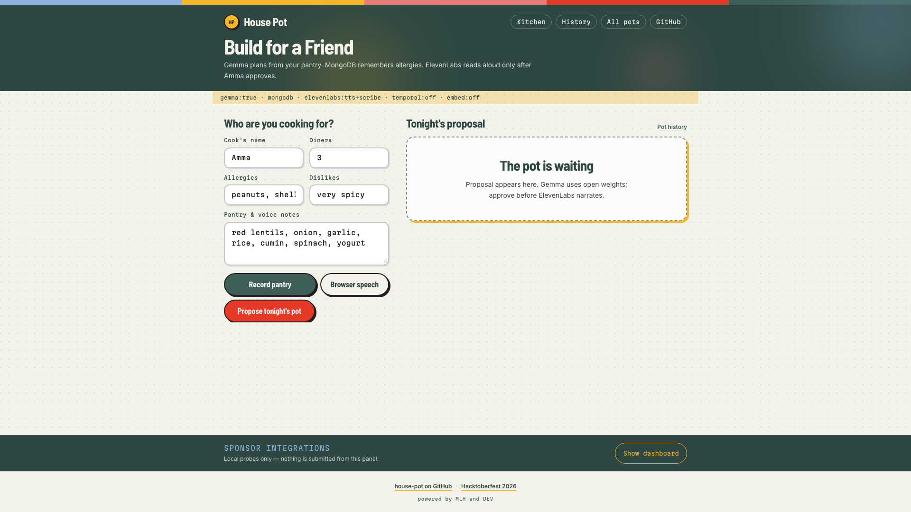
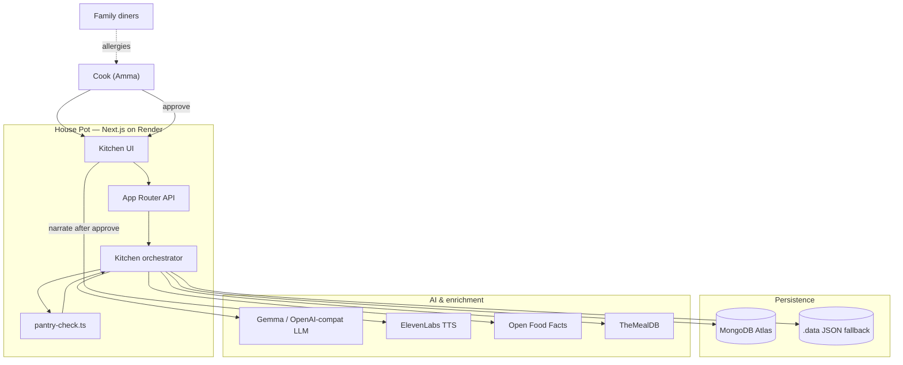
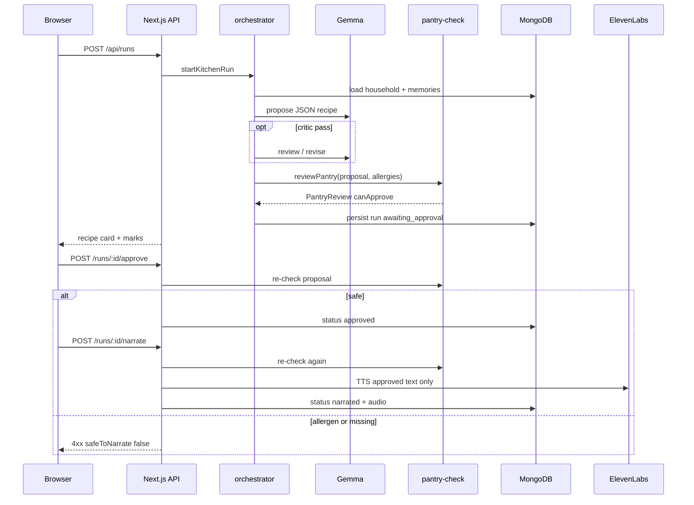
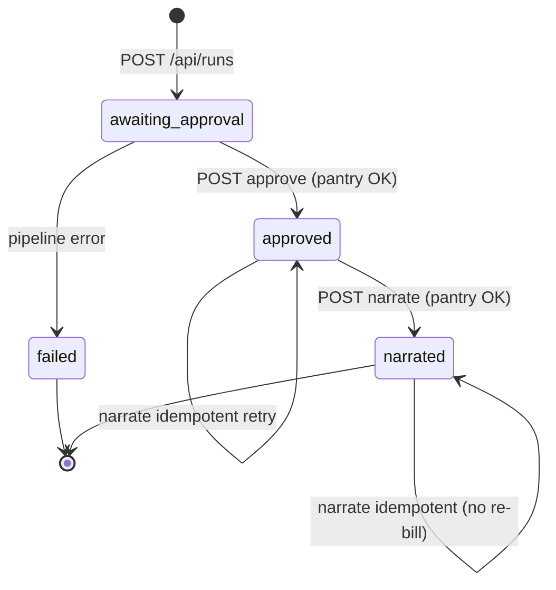
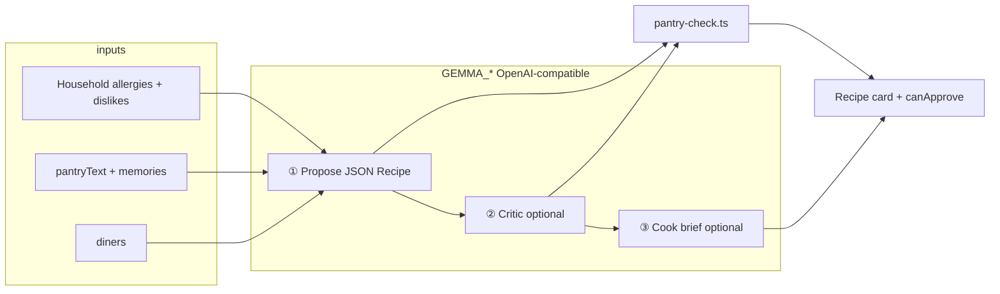
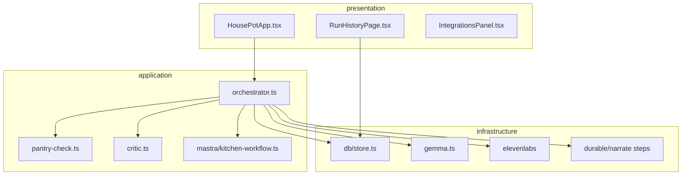
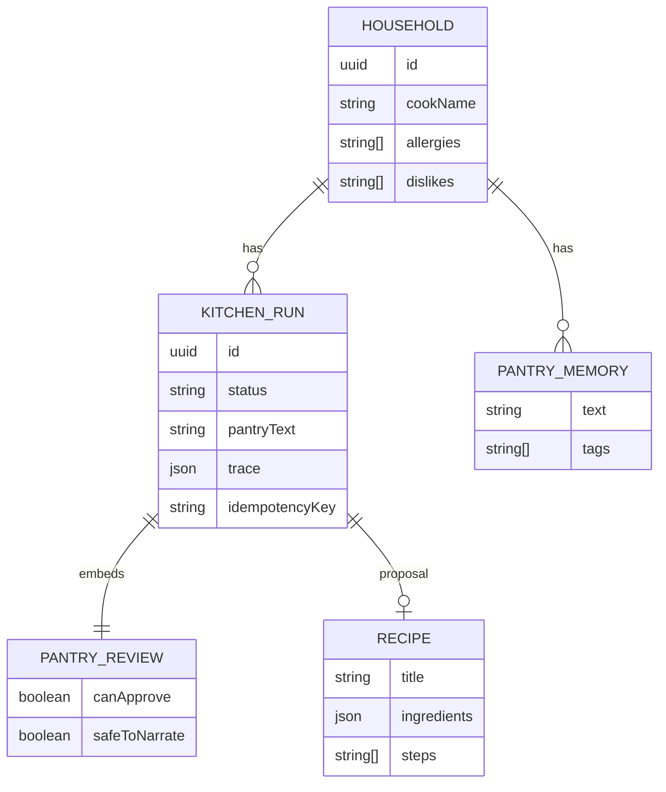

# House Pot

One recipe from tonight’s pantry. Allergies enforced in code. ElevenLabs speaks only after the cook taps approve.

Built for **Amma** in Dhaka — Hacktoberfest “Build for a Friend.” Challenge write-up: [`SUBMISSION.md`](./SUBMISSION.md).



**[Live demo](https://house-pot.onrender.com/)** · **[Narrated run](https://house-pot.onrender.com/?run=8073cda3-1865-4542-871b-5cba6afc9b4d)** · **[Video](https://house-pot.onrender.com/demo.mp4)** · **[DEV post](https://dev.to/smriad/house-pot-ammas-kitchen-in-dhaka-approve-first-then-listen-2mi9)**

## Quick start

```bash
git clone https://github.com/smriad/house-pot.git
cd house-pot
npm ci
cp .env.example .env.local
npm run dev
```

Open http://localhost:3000. Node 20+. Without `GEMMA_*` the kitchen UI still loads; propose needs an OpenAI-compatible Gemma endpoint (Ollama locally, or hosted keys — see [Configuration](#configuration)).

## Contents

- [About](#about)
- [Features](#features)
- [Tech stack](#tech-stack)
- [Getting started](#getting-started)
- [Architecture](#architecture)
- [Project structure](#project-structure)
- [HTTP API](#http-api)
- [Deployment](#deployment-render)
- [Contributing](#contributing)
- [License](#license)
- [Acknowledgements](#acknowledgements)
- [Author](#author)

## About

Weeknight dinner is **what is already in the kitchen**, **who is eating**, and **who cannot eat peanuts or shellfish** — not a trending shopping list. Generic meal apps trust prompt-only “allergy safe” claims and dump ten recipes while rice is on the stove.

House Pot gives Amma **one dish**, **visible pantry/allergen marks**, and **no narration** until she accepts that exact card. Defaults: cook **Amma**, allergies **peanuts** and **shellfish**, sample pantry `red lentils, onion, garlic, rice, cumin, spinach, yogurt`.

The same household profile works for anyone sharing one pantry and allergy list.

## Features

- **One JSON recipe** from pantry + allergies + diners (Gemma; optional critic)
- **`pantry-check.ts`** marks in-kitchen vs missing and **blocks Approve** on allergens (shrimp → shellfish)
- **ElevenLabs TTS** only after **Approve & read aloud**; approve and narrate re-run the same checks
- **If shrimp slipped in** — client-side demo of the gate (no model, no TTS)
- **MongoDB Atlas** (or `.data/house-pot.json`) for household, runs, and “less cumin next time”
- **Browser speech / Scribe / Whisper** for the pantry line; TTS never receives the voice note
- **Kitchen services** probe grid (`GET /api/health`) so you can see what is live
- **Optional:** multi-draft rank (`PROPOSE_CANDIDATES`), TabPFN locally, embedding allergen *hints* only

## Tech stack

| Layer | What |
| --- | --- |
| App | Next.js 16 (App Router) · React 19 · TypeScript · Tailwind CSS 4 |
| Plan | Gemma via `GEMMA_*` (Ollama `gemma3:4b` locally, hosted on Render) |
| Policy | `pantry-check.ts` + Zod `recipeSchema` |
| Voice | ElevenLabs after approve |
| Data | MongoDB Atlas · JSON fallback |
| Host | Render (`render.yaml`) |

**Flow:** household memory → Gemma propose → pantry/allergen review → recipe card → human approve → narrate.

## Getting started

### Prerequisites

- Node.js 20+ (CI uses 24) and npm
- For real recipes locally: [Ollama](https://ollama.com) with `gemma3:4b` (optional `nomic-embed-text`)
- Optional: Python 3 + `requirements.txt` (Whisper), `requirements-tabpfn.txt` (TabPFN)
- Optional: Docker Compose (`npm run stack:up`, `npm run temporal:up`)

### Configuration

```bash
cp .env.example .env.local   # never commit .env.local
```

| Variable | Required | Purpose |
| --- | --- | --- |
| `GEMMA_BASE_URL` | For real recipes | OpenAI-compatible root (e.g. `http://127.0.0.1:11434/v1`) |
| `GEMMA_API_KEY` | With hosted LLM | Provider API key (`ollama` for local Ollama) |
| `GEMMA_MODEL` | Recommended | Model id (e.g. `gemma3:4b`, `gemma-4-26b-a4b-it`, `gemini-3.8-flash`) |
| `MONGODB_URI` | Production | Atlas; omit for `.data/house-pot.json` |
| `ELEVENLABS_API_KEY` | Narration | TTS after approval |
| `ELEVENLABS_VOICE_ID` | Optional | Voice selection |
| `NEXT_PUBLIC_APP_URL` | Production | Public origin |
| `SERPAPI_API_KEY` | Optional | Substitute hints |
| `SENTRY_DSN` | Optional | Error and agent tracing |
| `TEMPORAL_ADDRESS` | Optional | Durable narration worker |
| `TEMPORAL_NARRATE` | Optional | `false` = in-process narrate |
| `TABPFN_DISABLE` | Render | `true` skips Python TabPFN |
| `PROPOSE_CANDIDATES` | Optional | `1`–`3` Gemma drafts + rank |
| `EXTRACT_PANTRY_ON_TRANSCRIBE` | Optional | `false` skips Gemma pantry parse after Whisper |
| `MONGODB_VECTOR_INDEX` | Optional | Atlas vector index for memories |
| `BACKBOARD_*`, `TIGER_DATABASE_URL` | Optional | Extra memory mirrors |

Full commented examples: `.env.example`.

**Typical local `.env.local`:**

```env
GEMMA_BASE_URL=http://127.0.0.1:11434/v1
GEMMA_API_KEY=ollama
GEMMA_MODEL=gemma3:4b
MONGODB_URI=<Atlas or leave empty for .data JSON>
ELEVENLABS_API_KEY=<key>
```

**Typical live (Render) env:**

```env
NEXT_PUBLIC_APP_URL=https://house-pot.onrender.com
GEMMA_BASE_URL=https://generativelanguage.googleapis.com/v1beta/openai/
GEMMA_API_KEY=<AI Studio key>
GEMMA_MODEL=gemini-3.8-flash
MONGODB_URI=<Atlas connection string>
ELEVENLABS_API_KEY=<key>
TEMPORAL_NARRATE=false
TABPFN_DISABLE=true
```

### Run locally

```bash
npm ci
npm run dev
```

Kitchen stores `house-pot-household-id` in `localStorage`. History: `/history` (this household), `/history/all` (every run), `/history?household=<uuid>`.

```bash
npm test
npm run lint
npm run build
npm run smoke:prod        # production /api/health (no secrets)
npm run export:training   # meal_fit_training dump (needs MONGODB_URI)
```

Full local stack: `npm run stack:up` · `npm run temporal:up` · `npm run temporal:worker`.

### Local vs live

| | **Local** (`npm run dev`) | **Live** ([Render](https://house-pot.onrender.com/)) |
| --- | --- | --- |
| **Purpose** | Full stack, open-weight Gemma | Public demo |
| **App URL** | `http://localhost:3000` | `https://house-pot.onrender.com` |
| **Health** | `/api/health` | same on Render |
| **LLM** | Ollama `gemma3:4b` | Hosted `GEMMA_*` |
| **Database** | Atlas or `.data/house-pot.json` | MongoDB Atlas |
| **Whisper / TabPFN / Temporal** | Optional | Off on the Node blueprint |
| **ElevenLabs** | `.env.local` | Render env |
| **Cold start** | None | Free tier ~60s |

Use **Kitchen services** or `GET /api/health` to see which probes are `live`.

## Architecture

**Plan (Gemma)** → **policy (`pantry-check.ts`)** → **deliver (ElevenLabs, gated)**. Safety stays outside the LLM. Approve binds to **this** `proposal` and **this** `pantryReview` ([artifact-tied approval](https://dev.to/hiroshi_takamura_c851fe71/tie-human-approval-to-the-exact-version-an-ai-agent-delivered-b6e)).







```text
┌─────────────┐     ┌──────────────────┐     ┌─────────────────┐
│  Web UI     │────▶│  API routes      │────▶│  orchestrator   │
│  (React)    │     │  (Next.js App)   │     │  kitchen/*      │
└─────────────┘     └────────┬─────────┘     └────────┬────────┘
                             │                        │
                    ┌────────┴────────┐    ┌──────────┴──────────┐
                    │ MongoDB Atlas   │    │ Gemma, ElevenLabs,   │
                    │ (or .data JSON) │    │ TheMealDB, OFF, …    │
                    └─────────────────┘    └─────────────────────┘
```

| Zone | Data | Leaves the household? |
| --- | --- | --- |
| Browser | `localStorage` household / last run id | Stays on device |
| LLM provider | Pantry, allergies, diners in prompts | Yes — self-host Gemma to keep planning local |
| MongoDB Atlas | Household, runs, feedback | Yes — your Atlas region |
| ElevenLabs | **Approved recipe text only** | Yes — never the pantry voice note |
| Policy code | Allergen rules in TypeScript | Your Node process; auditable in repo |

### Propose pipeline (`startKitchenRun`)

| Step | Component | Description |
| --- | --- | --- |
| 1 | Mastra | Approval gate when LibSQL is available |
| 2 | Memory | Mongo pantry snippets + optional vector search |
| 3 | SerpApi | Substitute hints (optional) |
| 4 | TheMealDB | Public meal names (no key) |
| 5 | Gemma (`propose-rank.ts`) | One or more drafts; rank by fit + pantry |
| 6 | Open Food Facts | Allergen tags / macros |
| 7 | Gemma critic | Optional rewrite |
| 8 | `pantry-check.ts` | In-pantry / missing / allergen blocks |
| 8b | `allergen-semantics.ts` | Near-miss **hints** only (does not change `safeToNarrate`) |
| 9 | TabPFN + heuristic | Friend-fit score (Python optional locally) |
| 10 | Gemma brief | One-sentence cook summary |
| — | `pantry-extract.ts` | After transcribe; disable with `EXTRACT_PANTRY_ON_TRANSCRIBE=false` |
| — | Feedback | Memory + `meal_fit_training` row |

Approve and narrate **re-run** pantry checks. Temporal narrates only when `TEMPORAL_ADDRESS` is reachable; Render uses in-process (`TEMPORAL_NARRATE=false`). Sentry spans when `SENTRY_DSN` is set; `GET /api/runs/:id/trace` always has `KitchenRun.trace`.

### LLM graph (propose)

Only the first completion is required.



**Local:** `gemma3:4b` on Ollama. **Live:** same client, `GEMMA_MODEL` hosted. JSON parsing in `gemma.ts` strips markdown / `<thought>` blocks.

### Components



### Design principles

1. **Plan (probabilistic)** — Gemma JSON (`recipeSchema`). Critic and cook brief are separate completions, not safety logic.
2. **Policy (deterministic)** — `pantry-check` is the system of record. Prompts may mention allergies; **code** enforces them on the card.
3. **Deliver (gated)** — ElevenLabs gets approved recipe text only.

| Practice | How |
| --- | --- |
| Separation of concerns | UI → API routes → `orchestrator.ts` → adapters |
| Schema-first LLM I/O | Zod + `extractRecipeJsonText()` |
| Idempotency | `idempotencyKey` on narrate |
| Graceful degradation | Mongo → `.data/house-pot.json`; `TABPFN_DISABLE` on Render |
| Observability | `trace[]`, Sentry, `/api/health` |
| Test the policy layer | Unit tests on `pantry-check`, not model creativity |

### Requirements (BRD)

| Business requirement | User story | Module / API |
| --- | --- | --- |
| Tonight’s pantry, not a shopping list | “What can I make with what we bought?” | `POST /api/runs` |
| Allergy safety without trusting the model | “My cousin cannot eat peanuts.” | `pantry-check.ts` on propose, approve, narrate |
| One answer | “Don’t give me ten recipes.” | One JSON `Recipe` |
| No voice until approve | “I won’t listen until I tap approve.” | `approve` → `narrate` |
| Remember the kitchen | “Less cumin next time.” | `POST /api/runs/:id/feedback` |
| Auditable | “Show me why approve was off.” | `GET /api/runs/:id/trace` |
| Demo without Ollama | Judges on a phone | Render + hosted `GEMMA_*` |

Non-goals for v1: weekly meal plans, grocery delivery, replacing the cook’s judgment, sending raw pantry audio to ElevenLabs.

## Project structure

```text
src/
  app/api/           household, runs, health, transcribe, …
  components/        HousePotApp, history, Kitchen services
  lib/
    gemma.ts         LLM client + JSON extract
    gemma/           pantry-extract after STT
    kitchen/         orchestrator, pantry-check, critic, propose-rank, …
    db/              Mongo + JSON fallback
    mastra/          optional approval workflow
    durable/         idempotent narrate
    temporal/        optional worker
scripts/             demo capture/slideshow, seed/prune, export training
public/              demo.mp4, demo-screenshots/, cover.jpg
.github/workflows/   house-pot.yml, live-smoke.yml
render.yaml
```

## Technologies — how and why

Tables match **local** `GET /api/health` vs **[Render](https://house-pot.onrender.com/api/health)** today. Kitchen services runs **17** probes (Render, GitHub Actions, Entire — no DigitalOcean). SerpApi is off on production (no key). Whisper, Temporal, embeddings, and TabPFN are off on the Render Node blueprint **by design**.

### Core

| Technology | How | Why |
| --- | --- | --- |
| **Next.js 16** | Kitchen UI + `/api/*` | One deployable app; safety on the server |
| **React 19** + **TypeScript** | Recipe card, approve gate | UI follows `awaiting_approval` → `narrated` |
| **Tailwind CSS 4** | Touch-friendly layout | Usable at the stove |
| **Zod** | `recipeSchema` | Catch bad JSON before the card |
| **OpenAI Node SDK** | `gemma.ts` → `GEMMA_*` | One client for Ollama and hosted |

### Plan / policy / voice / memory

| Technology | How | Why |
| --- | --- | --- |
| **Ollama Gemma `gemma3:4b`** | `proposeRecipe()` | Open-weight planning on a laptop |
| **Hosted `GEMMA_*`** | Same path on Render | Judges without Ollama |
| **`pantry-check.ts`** | Marks + allergen block | Allergy control is code |
| **Open Food Facts / TheMealDB** | Tags + dish names | Grounding without extra keys |
| **ElevenLabs** | TTS after approve | Recipe text only |
| **Whisper** (local) | `POST /api/transcribe` | Not on the Render blueprint |
| **MongoDB Atlas** | Households, runs, feedback | `.data/` JSON if URI unset |
| **Backboard / Tiger Data** | Optional memory mirrors | Extra context |

### ML, workflows, deploy

| Technology | How | Why |
| --- | --- | --- |
| **`propose-rank.ts`** | `PROPOSE_CANDIDATES` 1–3 | Rank without a recipe feed |
| **`meal_fit_training`** | Feedback → export | Offline TabPFN / sklearn |
| **`allergen-semantics.ts`** | Cosine hints | Never replaces `pantry-check` |
| **Mastra + LibSQL** | Optional suspend-on-approve | HITL workflow |
| **Temporal** | Local durable narrate | Off on Render |
| **TabPFN** | Local friend-fit | Heuristic on Render |
| **Sentry / `trace[]`** | Spans + audit | `GET /api/runs/:id/trace` |
| **Render / GitHub Actions** | `render.yaml`, CI | Public demo + lint/build/smoke |
| **Playwright + ffmpeg** | `demo:screenshots` | Judge video |

## HTTP API

| Method | Path | Description |
| --- | --- | --- |
| `GET` | `/api/health` | Integration probe summary |
| `GET` | `/api/integrations` | Full dashboard status |
| `POST` | `/api/household` | Create/update cook profile |
| `GET` | `/api/household?id=` | Fetch household |
| `GET` | `/api/household/:id/runs` | List runs |
| `GET` | `/api/household/:id/memories` | Pantry memories |
| `GET` | `/api/pots` | All runs (`limit`, `skip`; cached 30s) |
| `POST` | `/api/runs` | Propose (`householdId`, `pantryText`, `diners`) |
| `GET` | `/api/runs/:id` | Fetch run |
| `POST` | `/api/runs/:id/approve` | `{ approved, autoNarrate? }` |
| `POST` | `/api/runs/:id/narrate` | TTS |
| `POST` | `/api/runs/:id/feedback` | Cook feedback |
| `GET` | `/api/runs/:id/trace` | Agent steps |
| `GET` | `/api/runs/:id/entire` | Entire-compatible export |
| `POST` | `/api/transcribe` | Whisper STT |

Approve/narrate return 4xx when `safeToNarrate` is false.

## Data model



MongoDB database: **`house_pot`**. If `MONGODB_URI` is set but Atlas is unreachable, `store.ts` falls back to **`.data/house-pot.json`**.

## Deployment (Render)

Blueprint: `render.yaml` — `npm install && npm run build`, `npm start`, health `/api/health`.

1. Connect the GitHub repo in Render.
2. Set at least `MONGODB_URI`, `GEMMA_*`, `ELEVENLABS_API_KEY`, `NEXT_PUBLIC_APP_URL`.
3. Allow Render egress on Atlas (often `0.0.0.0/0` for a public demo).
4. Do not point `GEMMA_BASE_URL` at localhost. Use AI Studio or Groq (see `.env.example`).
5. Leave Temporal unset on free tier.

For Whisper on a host, use the `Dockerfile` instead of the Node blueprint.

## Continuous integration

| Workflow | Trigger | Jobs |
| --- | --- | --- |
| `house-pot.yml` | push/PR to `main` | `npm test` → `build` + `lint` → optional `RENDER_DEPLOY_HOOK` |
| `live-smoke.yml` | daily / manual | `scripts/smoke-production.sh` |

Optional repo secret `RENDER_DEPLOY_HOOK`. Smoke tests need no GitHub secrets.

| Layer | Check |
| --- | --- |
| Policy | `npm test` — pantry, shellfish/peanut, JSON extract |
| Build | CI `build` + `lint` |
| Live | `live-smoke.yml` + `smoke:prod` |
| Manual | Propose → marks → approve → narrate (60–120s on Render) |

## Demo assets

https://house-pot.onrender.com/demo.mp4 · https://house-pot.onrender.com/demo-screenshots/

```bash
BASE_URL=https://house-pot.onrender.com npm run demo:screenshots
DEMO_REUSE_VOICE=0 npm run demo:from-screenshots
```

| PNG | What it shows |
| --- | --- |
| `01-kitchen-top.png` | Kitchen hero + eggplant curry |
| `02-kitchen-form.png` | Sunday-market pantry |
| `03-approved-recipe.png` | Shrimp-slip gate + ElevenLabs |
| `04-integrations-dashboard.png` | Kitchen services |
| `05-history-all.png` | All pots |
| `06-household-history.png` | Amma household history |

| Command | Purpose |
| --- | --- |
| `npm run demo:screenshots` | Playwright → `public/demo-screenshots/` |
| `npm run demo:from-screenshots` | Voiced `demo.mp4` (`SLIDESHOW_CHAPTERS`) |
| `npm run demo:record` | Optional ~6 min tour |
| `npm run demo:splice-screenshots` | Append stills to an existing tour |
| `npm run demo:remix` | Rebuild tour audio from `.data/demo-timeline.json` |

Voice copy: `scripts/lib/demo-voice.mjs`.

## Agent sessions

Liquid embeds live in [`SUBMISSION.md`](./SUBMISSION.md) and the [DEV post](https://dev.to/smriad/house-pot-ammas-kitchen-in-dhaka-approve-first-then-listen-2mi9). GitHub does not render ``.

| Session | Covers |
| --- | --- |
| [422](https://dev.to/agent_sessions/house-pot-demo-video-tech-voiceover-and-dev-submission-sync-xuczlj) | Demo video, voiceover, DEV sync |
| [432](https://dev.to/agent_sessions/house-pot-full-hf26-build-log-demo-ml-submission-sync-eezqug) | Full HF26 build log |

## Contributing

See [`CONTRIBUTING.md`](./CONTRIBUTING.md). Follow the [`CODE_OF_CONDUCT.md`](./CODE_OF_CONDUCT.md). Report vulnerabilities privately via [`.github/SECURITY.md`](./.github/SECURITY.md) — do not open a public issue for secrets or exploit details.

```bash
npm run lint && npm test && npm run build
```

## License

[MIT](./LICENSE) © 2026 SM Riad.

## Acknowledgements

- [Gemma](https://ai.google.dev/gemma) / Ollama for open-weight planning
- [ElevenLabs](https://elevenlabs.io/) for gated TTS
- [MongoDB Atlas](https://www.mongodb.com/atlas) for household memory
- [Render](https://render.com/) for the public demo
- [Open Food Facts](https://world.openfoodfacts.org/) and [TheMealDB](https://www.themealdb.com/) for grounding
- [Hacktoberfest](https://hacktoberfest.com/) · [MLH](https://mlh.io/) · [DEV](https://dev.to/)

## Author

**S. M. Riad** ([@smriad](https://github.com/smriad)) — [dev.to/smriad](https://dev.to/smriad)
