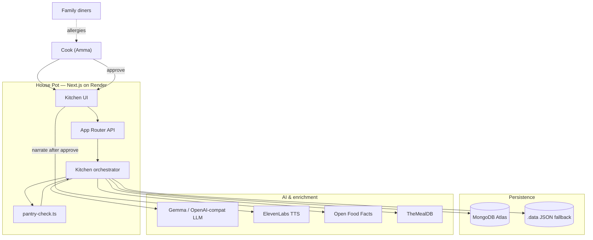
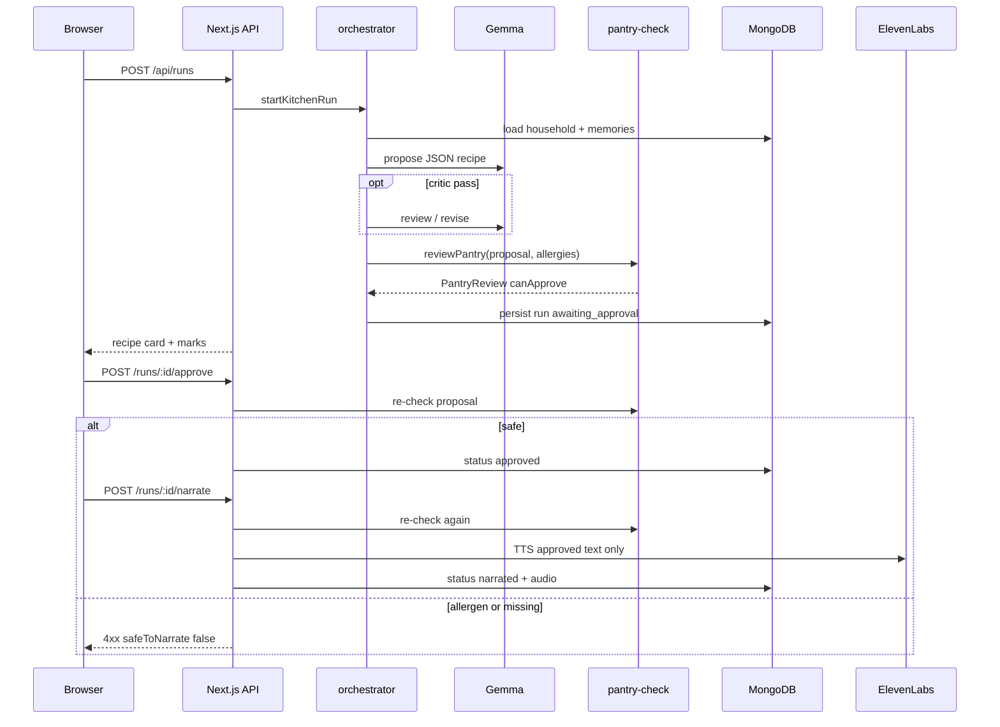
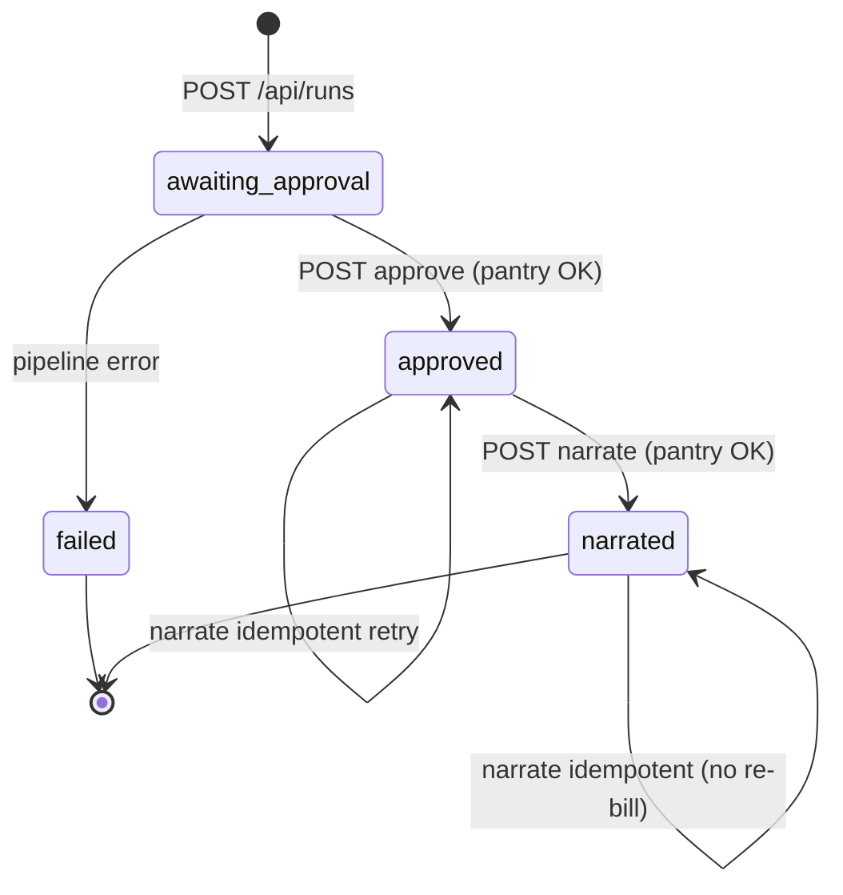
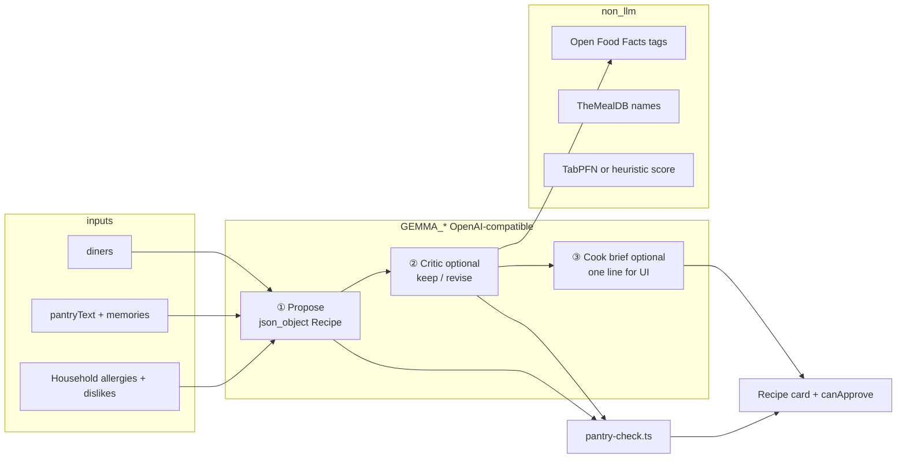
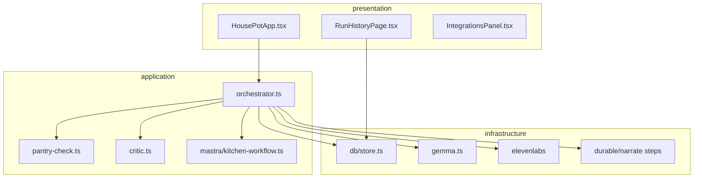
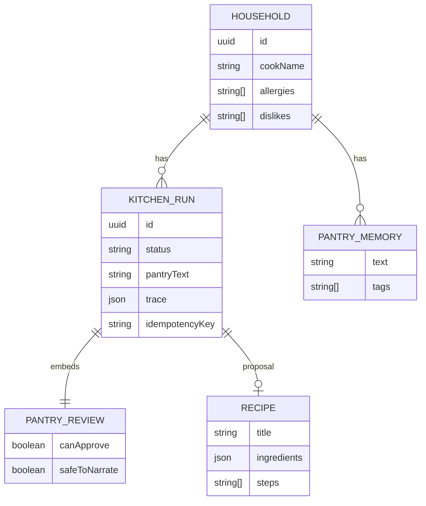

# House Pot

Next.js app for a household cook: one recipe from tonight’s pantry, allergies enforced in code, ElevenLabs TTS only after explicit approve. Hacktoberfest “Build for a Friend” write-up: [`SUBMISSION.md`](./SUBMISSION.md).

**Live:** https://house-pot.onrender.com/  
**Local:** http://localhost:3000 (`npm run dev`)  
**Repository:** https://github.com/smriad/house-pot

## The problem

Weeknight dinner is driven by **what is already in the kitchen** (post-market dal, rice, greens), **who is eating**, and **who cannot eat peanuts or shellfish**—not by shopping for a trending recipe. Generic meal apps and chat chefs assume you will buy their ingredient list, trust prompt-only “allergy safe” claims, and read long steps while rice is on the stove. House Pot targets cooks who need **one clear dish**, **visible safety checks**, and **no narration** until they accept that exact card.

## Who it's for

Built for **Amma**, the cook in our Dhaka household: improvises from habit, keeps the family allergy list, and does not want a generic “AI chef” experience. The same model fits **family members** on one pantry and allergy profile. UI defaults match our kitchen: cook **Amma**, allergies **peanuts** and **shellfish**, sample pantry `red lentils, onion, garlic, rice, cumin, spinach, yogurt`.

## How we're solving it

| Goal | Approach |
| --- | --- |
| One dinner, not a feed | **Gemma** (`GEMMA_*`, OpenAI-compatible) returns one **JSON** recipe from pantry + allergies + diners (optional critic pass, cook brief) |
| Safety you can see | **`pantry-check.ts`** marks in-kitchen vs missing; **blocks Approve** on allergen matches (e.g. shrimp → shellfish); Open Food Facts when available |
| No surprise audio | **ElevenLabs** only after **Approve & read aloud**; approve and narrate **re-run** the same checks (idempotent narrate on retry) |
| Memory across nights | **MongoDB Atlas** (or local `.data/house-pot.json`) for household, runs, feedback; optional **vector search** on memories |
| Hands at the stove | Browser speech, Scribe, or optional Whisper for pantry input; optional **Gemma pantry extract** after STT; TTS gets **approved recipe text**, not the voice note |
| Learn from feedback | **`meal_fit_training`** rows (features + sentiment label) on `POST /api/runs/:id/feedback`; export with `npm run export:training` |
| Smarter propose (optional) | **`PROPOSE_CANDIDATES`** (1–3): multiple Gemma drafts, rank with heuristic + TabPFN; **embedding allergen hints** are informational only |

## Architecture (summary)

**Stack:** Next.js (React + App Router APIs) on **Render** · **MongoDB Atlas** · **Gemma** planning · **ElevenLabs** TTS · optional **Mastra** suspend-on-approve when LibSQL is up.

**Flow:** household memory → propose (Gemma + optional grounding) → deterministic pantry/allergen review → recipe card → human approve → narrate. Diagrams, state machine, and API contracts are in [Architecture](#architecture) below.

---

## Requirements traceability (BRD → engineering)

| Business requirement | User story (Amma) | Technical capability | Primary module / API |
| --- | --- | --- | --- |
| Cook from **tonight’s pantry**, not a shopping list | “What can I make with what we bought?” | Single-recipe propose from `pantryText` + household constraints | `POST /api/runs` → `startKitchenRun` |
| **Allergy safety** must not rely on the model alone | “My cousin cannot eat peanuts.” | Deterministic `PantryReview`: allergen match blocks `canApprove` / `safeToNarrate` | `pantry-check.ts`; re-run on approve + narrate |
| **One answer**, not a feed | “Don’t give me ten recipes.” | One JSON `Recipe` per run; critic may revise once | `gemma.ts`, `critic.ts` |
| **No voice until I approve** | “I won’t listen until I tap approve.” | Status gate `awaiting_approval` → `approved` → `narrated`; TTS only after approve | `approve/route.ts`, `narrate/route.ts` |
| **Remember our kitchen** across nights | “Less cumin next time.” | Household + `PantryMemory` + run history + feedback | `store.ts`, `POST /api/runs/:id/feedback` |
| **Improve scoring over time** | “That fit score felt wrong.” | Feedback stores TabPFN-style features + label in `meal_fit_training` for offline export | `meal-fit-features.ts`, `insertMealFitTrainingRow` |
| **Auditable** for family / judges | “Show me why approve was off.” | Ingredient marks on card; `KitchenRun.trace` per step | `GET /api/runs/:id/trace` |
| **Demo without installing Ollama** | Judges on mobile data | Hosted `GEMMA_*` + Render; local Ollama path documented | `render.yaml`, health probes |

Non-goals for v1: meal planning for the week, grocery delivery, replacing the cook’s judgment, sending raw voice audio to the narration provider.

---

## Design principles & methodology

House Pot follows a **policy–plan–deliver** split common in agent systems, with **safety outside the LLM**:

1. **Plan (probabilistic)** — open-weight / OpenAI-compatible **Gemma** proposes structured JSON (`recipeSchema`). Optional **critic** pass and **cook brief** are separate chat completions, not merged into safety logic.
2. **Policy (deterministic)** — TypeScript **`pantry-check`** is the system of record for in-pantry marks, missing items, and allergen blocks. Prompts may mention allergies; **code** enforces them on the exact ingredient list shown on the card.
3. **Deliver (gated)** — **ElevenLabs** receives only **approved recipe text** (steps + title), never the voice note used for pantry input.

**Human-in-the-loop pattern:** [approval tied to the artifact](https://dev.to/hiroshi_takamura_c851fe71/tie-human-approval-to-the-exact-version-an-ai-agent-delivered-b6e) — approve binds to **this** `proposal` and **this** `pantryReview`. Approve and narrate **re-validate** so a stale “yes” cannot narrate a changed allergen set.

**Operational practices:**

| Practice | How House Pot applies it |
| --- | --- |
| **Separation of concerns** | UI (`HousePotApp`) → thin API routes → `orchestrator.ts` → adapters (`gemma`, `elevenlabs`, `db`) |
| **Schema-first LLM I/O** | Zod `recipeSchema` + `extractRecipeJsonText()` (strip thought blocks, salvage JSON) |
| **Idempotency** | `idempotencyKey` on narrate; safe retries without double TTS billing |
| **Graceful degradation** | Mongo unreachable → `.data/house-pot.json`; TabPFN off on Render (`TABPFN_DISABLE`); Mastra optional |
| **Observability** | `trace[]` on every run; Sentry spans on agent steps; `GET /api/health` integration matrix |
| **Environment parity** | Same codebase; capability matrix in [Local vs live](#local-vs-live) |
| **Test the policy layer** | Unit tests on `pantry-check`, OFF helpers, JSON extract — not on model creativity |

---

## System context (C4 — level 1)



---

## Request lifecycle (sequence)



---

## Run state machine



Terminal states for the cook: **`awaiting_approval`** (read card, marks visible), **`narrated`** (audio available). **`failed`** surfaces in UI with `trace` for debugging.

---

## LLM / chat model graph (propose path)

Multiple **chat completions** participate in one run; only the first is required for a minimal deployment.



**Local:** `gemma3:4b` on Ollama. **Live:** same client, hosted model id in `GEMMA_MODEL`. JSON parsing is defensive (`gemma.ts`) because open models may emit markdown or `<thought>` blocks.

---

## Component view (containers)



---

## Local vs live

| | **Local** (`npm run dev`) | **Live** ([Render](https://house-pot.onrender.com/)) |
| --- | --- | --- |
| **Purpose** | Full stack, open-weight Gemma, debugging | Public demo for judges and cooks |
| **App URL** | `http://localhost:3000` | `https://house-pot.onrender.com` |
| **Health probe** | `http://localhost:3000/api/health` | `https://house-pot.onrender.com/api/health` |
| **History** | `/history` (uses `localStorage` household id) | Same; or `/history?household=<uuid>` |
| **LLM** | Ollama `gemma3:4b` at `127.0.0.1:11434` (recommended) | Hosted OpenAI-compatible API (`GEMMA_*` on Render) |
| **Gemma model** | `GEMMA_MODEL=gemma3:4b` | e.g. `gemini-3.8-flash` or `gemma-4-26b-a4b-it` on AI Studio |
| **Database** | Atlas **or** `.data/house-pot.json` if `MONGODB_URI` unset | MongoDB Atlas (`MONGODB_URI` required for persistent history) |
| **Embeddings** | Ollama `nomic-embed-text` | Google `text-embedding-004` when `GEMMA_*` is AI Studio |
| **Whisper STT** | Yes (`pip install -r requirements.txt`, `POST /api/transcribe`) | No on default Node blueprint |
| **TabPFN score** | Yes if Python + `requirements-tabpfn.txt` | Heuristic fallback only |
| **Temporal narration** | Yes with `npm run temporal:up` + worker | Off (`TEMPORAL_NARRATE=false` in `render.yaml`) |
| **Mastra LibSQL** | `.data/mastra.db` after first approve | Ephemeral disk on free tier |
| **ElevenLabs** | API key in `.env.local` | Same keys in Render dashboard |
| **TheMealDB / Open Food Facts** | Yes (public HTTP) | Yes |
| **SerpApi / Backboard / Tiger** | Optional env keys | Optional env keys |
| **Cold start** | None | Free tier may sleep; first request up to ~60s |
| **CI smoke** | `npm run smoke:prod` hits **live** only | GitHub Actions `live-smoke.yml` |
| **TabPFN on propose** | Python + `tabpfn` when installed | `TABPFN_DISABLE=true` in `render.yaml` (fast heuristic) |

**Typical local `.env.local`:**

```env
GEMMA_BASE_URL=http://127.0.0.1:11434/v1
GEMMA_API_KEY=ollama
GEMMA_MODEL=gemma3:4b
MONGODB_URI=<Atlas or leave empty for .data JSON>
ELEVENLABS_API_KEY=<key>
```

**Typical live (Render) env:**

```env
NEXT_PUBLIC_APP_URL=https://house-pot.onrender.com
GEMMA_BASE_URL=https://generativelanguage.googleapis.com/v1beta/openai/
GEMMA_API_KEY=<AI Studio key>
GEMMA_MODEL=gemini-3.8-flash
MONGODB_URI=<Atlas connection string>
ELEVENLABS_API_KEY=<key>
TEMPORAL_NARRATE=false
TABPFN_DISABLE=true
```

Use the in-app **Sponsor integrations** panel or `GET /api/health` on each environment to see which probes are `live`.

**Demo assets (after deploy):** https://house-pot.onrender.com/cover.jpg · https://house-pot.onrender.com/demo.mp4 · https://house-pot.onrender.com/demo-screenshots/

**Recommended judge video (~50s, voiced):** capture five live PNGs, then mux with ElevenLabs narration (one voice line per slide).

```bash
BASE_URL=https://house-pot.onrender.com npm run demo:screenshots
DEMO_REUSE_VOICE=0 npm run demo:from-screenshots   # needs ELEVENLABS_API_KEY in .env.local
```

| PNG | What it shows |
| --- | --- |
| `01-kitchen-top.png` | Kitchen hero |
| `02-kitchen-form.png` | Cook profile, pantry textarea, record/speech |
| `03-integrations-dashboard.png` | **Sponsor integrations** probe grid (full viewport) |
| `04-history-all.png` | All pots (`/history/all`) |
| `05-household-history.png` | Amma household history |

| Command | Purpose |
| --- | --- |
| `npm run demo:screenshots` | Playwright capture → `public/demo-screenshots/` (set `BASE_URL` for live) |
| `npm run demo:from-screenshots` | **Primary:** `public/demo.mp4` from those PNGs + `SLIDESHOW_CHAPTERS` voice (`DEMO_SCREENSHOT_SEC`, default 2.5s min per slide; hold extends to fit narration) |
| `npm run demo:record` | Optional ~6 min Playwright tour + full `TOUR_CHAPTERS` voiceover (kitchen flow + narrated recipe) |
| `npm run demo:splice-screenshots` | Append `demo-screenshots/*.png` reel to an existing tour `demo.mp4` |
| `npm run demo:remix` | Rebuild tour audio from `.data/demo-timeline.json` without re-recording |

Voice scripts: `scripts/lib/demo-voice.mjs` — `SLIDESHOW_CHAPTERS` (5 slides) and `TOUR_CHAPTERS` (long tour). Scripts: `capture-demo-screenshots.mjs`, `build-demo-from-screenshots.mjs`.

---

## Architecture

Layered deployment view (same logical flow as the [sequence diagram](#request-lifecycle-sequence) above):

```text
┌─────────────┐     ┌──────────────────┐     ┌─────────────────┐
│  Web UI     │────▶│  API routes      │────▶│  orchestrator   │
│  (React)    │     │  (Next.js App)   │     │  kitchen/*      │
└─────────────┘     └────────┬─────────┘     └────────┬────────┘
                             │                        │
                    ┌────────┴────────┐    ┌──────────┴──────────┐
                    │ MongoDB Atlas   │    │ External services     │
                    │ (or .data JSON) │    │ Gemma, ElevenLabs,    │
                    └─────────────────┘    │ SerpApi, Backboard,   │
                                           │ TheMealDB, OFF, etc.  │
                                           └───────────────────────┘
```

**Trust boundaries**

| Zone | Data | Leaves the household? |
| --- | --- | --- |
| Browser | `localStorage` household id, last run id | Stays on device |
| LLM provider | Pantry text, allergies, diner count in prompts | Yes — choose open-weight / self-host for planning |
| MongoDB Atlas | Household, runs, feedback, memories | Yes — Atlas region under your control |
| ElevenLabs | **Approved recipe text only** after gate | Yes — never raw pantry voice note |
| Policy code | Allergen rules in TS | Runs on your Node process; auditable in repo |

### Propose pipeline (`startKitchenRun`)

| Step | Component | Description |
| --- | --- | --- |
| 1 | Mastra | Approval gate / suspend workflow when LibSQL storage is available |
| 2 | Memory | MongoDB pantry snippets + optional vector search; Backboard semantic hits |
| 3 | SerpApi | Substitute hints when pantry text implies missing items |
| 4 | TheMealDB | Public meal names as grounding (no API key) |
| 5 | Gemma (`propose-rank.ts`) | One or more recipe drafts (`PROPOSE_CANDIDATES`); rank by fit + pantry safety |
| 6 | Open Food Facts | Allergen tags and macro hints per ingredient |
| 7 | Gemma critic | Second pass; may rewrite recipe when review fails |
| 8 | Pantry review | Code-level in-pantry / missing / allergen blocks |
| 8b | `allergen-semantics.ts` | Optional embedding **near-miss hints** on the card (does not change `safeToNarrate`) |
| 9 | TabPFN + heuristic | Blended friend-fit score (Python optional locally) |
| 10 | Gemma brief | Optional one-sentence summary for the cook |
| — | `pantry-extract.ts` | After `POST /api/transcribe`, Gemma may return `pantryLine` + `items` (disable: `EXTRACT_PANTRY_ON_TRANSCRIBE=false`) |
| — | Feedback | Cook text → memory + **`meal_fit_training`** row for ML export |

Approve and narrate paths re-run pantry safety checks. Temporal may execute durable narration when `TEMPORAL_ADDRESS` is set and reachable; Render defaults to in-process narration (`TEMPORAL_NARRATE=false` in `render.yaml`).

Agent steps are wrapped with Sentry spans (`withAgentSpan`) when `SENTRY_DSN` is configured. Per-run step history is stored on the `KitchenRun.trace` array and exposed at `GET /api/runs/:id/trace`.

---

## Technologies — how and why

Tables below match what we **actually run**: **`live` on local dev** (`npm run dev` → `GET /api/health`) and what is **live on Render** today. **SerpApi** is not configured on production (no key). The in-app **Sponsor integrations** panel runs **17** local probes (deploy: Render, GitHub Actions, Entire export—no DigitalOcean path).

| Environment | Live integrations (summary) |
| --- | --- |
| **Local dev** | Gemma (Ollama), embeddings, Whisper, ElevenLabs, MongoDB, Mastra, Temporal, Backboard, Tiger, TabPFN, Sentry, TheMealDB, Open Food Facts |
| **[Render](https://house-pot.onrender.com/api/health)** | Gemma, MongoDB, ElevenLabs, Mastra, Backboard, Tiger, Sentry, TheMealDB, Open Food Facts — Whisper, Temporal, embeddings, TabPFN, SerpApi **off** by design |

Hacktoberfest narrative and prize framing: [`SUBMISSION.md`](./SUBMISSION.md). **Sponsor integrations** mirrors the same probes as `GET /api/integrations`.

### Core application

| Technology | How it's used | Why |
| --- | --- | --- |
| **Next.js 16** (App Router) | Kitchen UI + `/api/runs`, approve, narrate, health | One deployable app; safety checks on the server |
| **React 19** + **TypeScript** | Recipe card, approve gate, history | UI aligned with `awaiting_approval` → `narrated` |
| **Tailwind CSS 4** | Touch-friendly kitchen layout | Fast iteration at the stove |
| **Zod** | `recipeSchema` on Gemma output | Catch bad JSON before the card |
| **OpenAI Node SDK** | `gemma.ts` → `GEMMA_*` (Ollama local, hosted on Render) | One client for open weights and the public demo |

### Planning (probabilistic)

| Technology | How it's used | Why |
| --- | --- | --- |
| **Ollama + Gemma** `gemma3:4b` | `proposeRecipe()` → one JSON recipe | Open-weight planning on a laptop |
| **Gemma critic** | Optional full recipe replace once | Better draft; safety still in code |
| **Cook brief** | One-line card summary | Less reading while cooking |
| **Embeddings** (`nomic-embed-text`, local) | Rank pantry memories on propose | Surface “less cumin” without retyping |
| **Hosted `GEMMA_*`** (Render) | Same path on production URL | Judges without Ollama |

### Policy (deterministic — core product)

| Technology | How it's used | Why |
| --- | --- | --- |
| **`pantry-check.ts`** | Pantry marks + allergen block on approve | Allergy control is code, not a prompt |
| **Re-check on approve + narrate** | Same `PantryReview` on both routes | Stale approve cannot narrate new allergens |
| **Open Food Facts** | Allergen enrichment | Beyond string matching |
| **TheMealDB** | Dish-name grounding on propose | No API key |

### Voice

| Technology | How it's used | Why |
| --- | --- | --- |
| **ElevenLabs** | TTS after approve; idempotent narrate | Approved recipe text only—not the voice note |
| **Whisper** (local) | `POST /api/transcribe` | STT on dev machine; not on Render blueprint |

### Memory and persistence

| Technology | How it's used | Why |
| --- | --- | --- |
| **MongoDB Atlas** | Households, runs, memories, feedback | Memory across nights (`.data/` JSON fallback in code if URI unset) |
| **Backboard** | Semantic memories on propose / feedback | Longer kitchen context |
| **Tiger Data (Postgres)** | Feedback mirror after runs | SQL sidecar experiments |
| **`localStorage`** | Browser household id | No login; `?household=` for history |

### ML & learning loop

| Technology | How it's used | Why |
| --- | --- | --- |
| **`propose-rank.ts`** | `PROPOSE_CANDIDATES=2|3` → style hints, score, pick one winner | More intelligence without showing a recipe feed |
| **`meal-fit-features.ts`** | Shared feature vector for TabPFN + training rows | One schema for scoring and feedback labels |
| **`meal_fit_training` (Mongo)** | Written on feedback (`label` 0 / 0.5 / 1 from sentiment heuristics) | Export for TabPFN / sklearn experiments (`npm run export:training`) |
| **`allergen-semantics.ts`** | Cosine similarity ingredient ↔ allergy | Extra “verify manually” hints; **policy stays in `pantry-check`** |
| **`gemma/pantry-extract.ts`** | JSON pantry list from voice transcript | Cleaner pantry line before propose |

### Workflows, scoring, observability

| Technology | How it's used | Why |
| --- | --- | --- |
| **Mastra + LibSQL** | Approval gate until cook taps approve | Human-in-the-loop workflow |
| **Temporal** | Durable narrate when worker is up (local) | Retries in dev; `TEMPORAL_NARRATE=false` on Render |
| **TabPFN** (local Python) | Blended friend-fit score on propose | Dev signal; heuristic on Render (`TABPFN_DISABLE`) |
| **Sentry** | Agent step spans | Tracing; in-app `trace[]` always |
| **Run trace** | `GET /api/runs/:id/trace` | Step-by-step audit |

### Demo and deploy

| Technology | How it's used | Why |
| --- | --- | --- |
| **Render** | `render.yaml` | Public demo (`demo.mp4` + `demo-screenshots/` served as static files) |
| **GitHub Actions** | `house-pot.yml`, `live-smoke.yml` | Build, lint, production smoke |
| **Playwright + ffmpeg** | `demo:screenshots` + `demo:from-screenshots` | Voiced slideshow for judges; optional `demo:record` for full kitchen tour |
| **Docker Compose** | `docker-compose.temporal.yml` | Local Temporal only |

**Design line:** plan (Gemma) → policy (`pantry-check`) → deliver (ElevenLabs, gated).

---

## Repository layout

```text
src/
  app/api/           HTTP handlers (household, runs, health, transcribe, …)
  components/        HousePotApp, history, integrations dashboard
  lib/
    gemma.ts         LLM client, JSON extraction, kitchenChat helper
    gemma/           pantry-extract (STT → structured pantry)
    kitchen/         orchestrator, pantry-check, propose-rank, allergen-semantics, meal-fit-features, critic, …
    db/              Mongo + local JSON store (`meal_fit_training` collection)
    mastra/          Approval workflow
    durable/         Idempotent narration steps
    temporal/        Optional durable narration worker
scripts/             demo screenshots/slideshow, seed/prune live DB, export training, temporal-worker
public/              demo.mp4, demo-screenshots/, cover.jpg
.github/workflows/   house-pot.yml, live-smoke.yml
render.yaml          Render Blueprint (free web service)
Dockerfile           Node + Python + Whisper (full-stack hosts)
```

Challenge narrative (Amma’s Dhaka kitchen, market-to-pot flow, English pantry labels) lives in [`SUBMISSION.md`](./SUBMISSION.md).

---

## Prerequisites

- Node.js 20+ (CI uses 24)
- npm
- For full local AI: [Ollama](https://ollama.com) with `gemma3:4b` and optionally `nomic-embed-text`
- Optional: Python 3 + `requirements.txt` (Whisper), `requirements-tabpfn.txt` (TabPFN)
- Optional: Docker Compose (`npm run stack:up`, `npm run temporal:up`)

---

## Configuration

Copy the template and set secrets locally (never commit `.env.local`):

```bash
cp .env.example .env.local
```

| Variable | Required | Purpose |
| --- | --- | --- |
| `GEMMA_BASE_URL` | For real recipes | OpenAI-compatible root (e.g. `http://127.0.0.1:11434/v1`) |
| `GEMMA_API_KEY` | With hosted LLM | Provider API key (`ollama` for local Ollama) |
| `GEMMA_MODEL` | Recommended | Model id (e.g. `gemma3:4b`, `gemma-4-26b-a4b-it`, `gemini-3.8-flash` on AI Studio) |
| `MONGODB_URI` | Production | Atlas connection string; omit for `.data/house-pot.json` |
| `ELEVENLABS_API_KEY` | Narration | TTS after approval |
| `ELEVENLABS_VOICE_ID` | Optional | Voice selection |
| `NEXT_PUBLIC_APP_URL` | Production | Public origin (SEO, callbacks) |
| `SERPAPI_API_KEY` | Optional | Substitute and meal inspiration |
| `SENTRY_DSN` | Optional | Error and agent tracing |
| `TEMPORAL_ADDRESS` | Optional | Durable narration worker |
| `TEMPORAL_NARRATE` | Optional | Set `false` to force in-process narrate |
| `TABPFN_DISABLE` | Render | Set `true` to skip Python TabPFN on propose |
| `PROPOSE_CANDIDATES` | Optional | `1`–`3` Gemma drafts + rank (default `1` on Render) |
| `EXTRACT_PANTRY_ON_TRANSCRIBE` | Optional | Set `false` to skip Gemma pantry parse after Whisper |
| `MONGODB_VECTOR_INDEX` | Optional | Atlas vector index name for memory search |
| `BACKBOARD_*`, `TIGER_DATABASE_URL` | Optional | Extended memory mirrors |

See `.env.example` for the full list and commented cloud examples.

---

## Local development

```bash
npm ci
npm run dev
```

Open http://localhost:3000. The kitchen page stores `house-pot-household-id` in `localStorage`; history at `/history` lists runs for that household; **`/history/all`** lists every run on the server (`GET /api/pots`). Pass `?household=<uuid>` on `/history` to load another profile.

```bash
npm test          # unit tests (pantry-check, free-food, gemma JSON extract, meal-fit labels)
npm run lint
npm run build
npm run smoke:prod   # probes production /api/health (no secrets)
npm run seed:live    # propose → approve → narrate samples on production (needs live URL)
npm run prune:live   # keep only latest narrated Amma/Khalu/Farida in MongoDB
npm run export:training  # dump meal_fit_training JSON (needs MONGODB_URI)
```

Full sponsor stack locally:

```bash
npm run stack:up      # Mongo, Ollama models, env hints
npm run temporal:up   # Temporal server
npm run temporal:worker
```

---

## HTTP API

| Method | Path | Description |
| --- | --- | --- |
| `GET` | `/api/health` | Integration probe summary + `detail` object |
| `GET` | `/api/integrations` | Full integration status for the dashboard |
| `POST` | `/api/household` | Create/update cook profile |
| `GET` | `/api/household?id=` | Fetch household by id |
| `GET` | `/api/household/:id/runs` | List runs (`limit`, optional `runId`) |
| `GET` | `/api/household/:id/memories` | Pantry memory snippets |
| `GET` | `/api/pots` | All runs across households (`limit`, `skip`; list view, cached 30s) |
| `POST` | `/api/runs` | Start propose pipeline (`householdId`, `pantryText`, `diners`) |
| `GET` | `/api/runs/:id` | Fetch run |
| `POST` | `/api/runs/:id/approve` | `{ approved, autoNarrate? }` |
| `POST` | `/api/runs/:id/narrate` | Generate narration audio |
| `POST` | `/api/runs/:id/feedback` | Persist cook feedback to memory |
| `GET` | `/api/runs/:id/trace` | Agent step trace |
| `GET` | `/api/runs/:id/entire` | Entire-compatible export payload |
| `POST` | `/api/transcribe` | Whisper STT; may include `pantryLine`, `pantryItems`, `diners` when Gemma extract runs |

Errors on approve/narrate return when pantry review marks allergens (`safeToNarrate: false`).

---

## Deployment (Render)

The Blueprint in `render.yaml` defines a free-tier Node web service: `npm install && npm run build`, `npm start`, health check `/api/health`.

1. Connect the GitHub repository in Render (Blueprint or manual Web Service).
2. Set environment variables from the configuration table (minimum: `MONGODB_URI`, `GEMMA_*`, `ELEVENLABS_API_KEY`, `NEXT_PUBLIC_APP_URL`).
3. Atlas network access must allow Render egress (commonly `0.0.0.0/0` for demos).
4. Do not point `GEMMA_BASE_URL` at localhost on Render. Use a hosted OpenAI-compatible endpoint (Google AI Studio or Groq per `.env.example`).
5. Leave `TEMPORAL_ADDRESS` unset on free tier; `TEMPORAL_NARRATE` defaults to `false` in the Blueprint.

**Hosted LLM (typical):**

```env
GEMMA_BASE_URL=https://generativelanguage.googleapis.com/v1beta/openai/
GEMMA_API_KEY=<AI Studio key>
GEMMA_MODEL=gemini-3.8-flash
```

See **[Local vs live](#local-vs-live)** for capability differences. For Whisper on a host, use the `Dockerfile` instead of the default Render Node blueprint.

---

## Continuous integration

| Workflow | Trigger | Jobs |
| --- | --- | --- |
| `house-pot.yml` | push/PR to `main` | `npm test` → `build` + `lint` → optional `RENDER_DEPLOY_HOOK` POST |
| `live-smoke.yml` | daily schedule, manual | `scripts/smoke-production.sh` against production health |

Add repository secret `RENDER_DEPLOY_HOOK` (Render deploy hook URL) to redeploy after a green `main` build. No GitHub secrets are required for CI or smoke tests.

---

## Data model



- **Household** — cook name, allergies, dislikes, cuisines, notes (`householdSchema` in `types.ts`).
- **KitchenRun** — `pantryText`, `diners`, `status` (`awaiting_approval` | `approved` | `narrated` | `failed`), `proposal` (`Recipe`), `pantryReview` (includes optional `semanticHints`), `kitchenBrain`, `cookBrief`, `alternateTitles` (when multi-propose), `preferenceScore`, `trace[]`, optional `audioBase64`, `mastraRunId`.
- **PantryMemory** — post-run and feedback snippets; optional vector search when embeddings probe live.
- **MealFitTrainingRow** — `meal_fit_training` collection: features, feedback text, sentiment `label`, `runId`, `householdId` (for offline ML).

MongoDB database: **`house_pot`**. If `MONGODB_URI` is set but the cluster is unreachable, `store.ts` falls back to **`.data/house-pot.json`** so misconfigured Atlas does not hard-500 the demo.

---

## Quality engineering

| Layer | What we test / verify |
| --- | --- |
| **Policy** | `npm test` — pantry match, shellfish/peanut rules, JSON extract |
| **Build** | CI `build` + `lint` on every PR |
| **Live** | `live-smoke.yml` + `smoke:prod` → production `/api/health` |
| **Manual** | Propose → inspect marks → approve → narrate (allow 60–120s on Render) |

Recommended pre-release checklist: health shows `gemma` + `mongodb` + `elevenlabs` live; one full run with Amma defaults; refresh `demo-screenshots` + `demo.mp4` (`demo:screenshots` → `demo:from-screenshots`); commit static assets; [`SUBMISSION.md`](./SUBMISSION.md) and DEV post link to live URL + `demo.mp4`.

---

## License & community

| Document | Purpose |
| --- | --- |
| [LICENSE](./LICENSE) | MIT |
| [CODE_OF_CONDUCT.md](./CODE_OF_CONDUCT.md) | Community standards |
| [CONTRIBUTING.md](./CONTRIBUTING.md) | How to contribute |
| [.github/SECURITY.md](./.github/SECURITY.md) | Report vulnerabilities privately |
