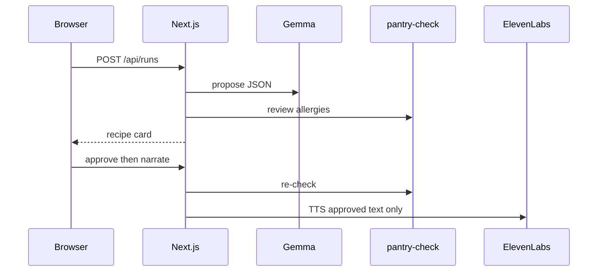

*Submission for [Hacktoberfest Weekend: Build for a Friend](https://dev.to/challenges/hacktoberfest-weekend-2026-10-01)* — `#hf26challenge`

**House Pot** is a kitchen app for **Amma** in Dhaka: **one** recipe from tonight’s pantry, allergies enforced in code, **ElevenLabs** only after she taps **Approve & read aloud**.

## The problem

Weeknight dinner in our flat is not “pick a trending recipe.” It is **what came back from the market**, who is eating, and **who cannot eat peanuts or shellfish**. That breaks down when:

- the pantry is **fixed for tonight** (dal, rice, greens—whatever was affordable)
- **allergy mistakes are not acceptable** (a cousin’s peanut reaction is not a disclaimer)
- the cook wants **one answer**, not ten options and a wall of text
- **voice is welcome**, but only after she has accepted the exact dish on screen

**Amma** runs our stove in Dhaka—habit, memory, and the household allergy list in her head. House Pot is for her and anyone in the same setup: real constraints, **approve-before-you-listen**.

Defaults: cook **Amma**, allergies **peanuts** and **shellfish**, pantry `red lentils, onion, garlic, rice, cumin, spinach, yogurt`.

## How I'm solving it

| Piece | What it does |
| --- | --- |
| **Gemma** | One structured JSON recipe from pantry + allergies (optional critic pass) |
| **`pantry-check.ts`** | In-kitchen vs missing; **blocks approve** on allergens—not “the model said it’s fine” |
| **ElevenLabs** | TTS only on the **approved** card; approve/narrate **re-run** the same checks |
| **MongoDB Atlas** | Household, runs, feedback (“less cumin next time”) |
| **Whisper** (local) | Pantry dictation; optional **Gemma pantry extract** after STT |
| **ML loop** | TabPFN + heuristic friend-fit; feedback → `meal_fit_training` rows (`npm run export:training`) |

**Design:** plan (Gemma, optional multi-draft rank) → policy (`pantry-check` + embedding **hints only**) → deliver (TTS gated on approve). Full BRD, C4, ML tables: [README](https://github.com/smriad/house-pot).

**ML (approve-first):** `PROPOSE_CANDIDATES` can ask Gemma for up to 3 drafts and pick one; semantic allergen near-misses show on the card but **never** replace code blocks. Cook feedback stores features for later TabPFN/sklearn export—not auto-retraining on Render.

**Smoke run:** Gemma proposed **Mild Spinach and Red Lentil Dal with Rice**; every ingredient matched the pantry; audio waited for approve.

## Architecture

Next.js on **Render** (public demo) · **Gemma** (Ollama locally, hosted `GEMMA_*` on Render) · **MongoDB** · deterministic **`pantry-check`** · **ElevenLabs** after approve · **Mastra** approval gate · optional **Temporal** narrate when a worker is up.

Same repo locally and live: my laptop runs Whisper, TabPFN, Temporal, Backboard/Tiger mirrors—see `GET /api/health`. Render turns off heavy Python paths so judges can click without Ollama.

## Demo

**Live:** https://house-pot.onrender.com/

<video src="https://house-pot.onrender.com/demo.mp4" controls width="100%" title="House Pot demo — technology tour and approved recipe narration"></video>

[~6 min tour + screenshot reel](https://house-pot.onrender.com/demo.mp4) · [Amma narrated run](https://house-pot.onrender.com/?run=bdb0308d-d198-4ef1-891f-bad4dc7aa50b) · [all pots](https://house-pot.onrender.com/history/all)

The video can end with a **screenshot slideshow** (kitchen, integrations dashboard, history). Regenerate: `npm run demo:screenshots` then `npm run demo:splice-screenshots` (or full `npm run demo:record` with the integrations chapter).

Sponsor integrations (live screenshots)

More PNGs in [public/demo-screenshots](https://github.com/smriad/house-pot/tree/main/public/demo-screenshots).

**Judges:** open the live URL (cold start on free tier ~60s). Scroll to **Sponsor integrations → Show dashboard** for the probe grid. Then propose with **Amma**, allergies **peanuts, shellfish**, tap **Approve & read aloud** only when marks look safe.

## Code

https://github.com/smriad/house-pot — `pantry-check.ts`, `orchestrator.ts`, `propose-rank.ts`, `meal-fit-features.ts`, `gemma/pantry-extract.ts`, `store.ts`, `HousePotApp.tsx`, `render.yaml`.

**Stack in one line:** Gemma plans (optional rank) · code enforces pantry + allergens · MongoDB remembers + training export · ElevenLabs after approve · `/history/all` for judges · `demo.mp4` via Playwright.

## Why Does Open Innovation Matter?

In a Dhaka household the sensitive data is not “inspiration.” It is **who reacts to peanuts**, what **Amma bought** before the monsoon rain, and what we **cannot** ship to a closed meal API abroad.

Open-weight **Gemma** can plan on a machine we run; validation stays ours. The Render demo uses hosted inference so judges anywhere can try it—I say that plainly rather than pretending the box is offline-only.

**ElevenLabs** is the closed piece, and it sits **behind** approve—it never sees the pantry voice note, only the recipe she accepted. MongoDB holds allergies, habits, and “a little less chili next time” so family lunch is not a repeat lecture.

## Prize Categories

- **Best Use of Gemma** — one pantry-constrained JSON recipe per night.
- **Best Use of ElevenLabs** — narration only after approve.
- **Best Use of MongoDB Atlas** — household memory + `meal_fit_training` feedback rows on the live URL.
- **Best Use of Render** — https://house-pot.onrender.com/ from `render.yaml`.

## My Agent Sessions



[Build log — demo video, voiceover, submission sync](https://dev.to/agent_sessions/house-pot-demo-video-tech-voiceover-and-dev-submission-sync-xuczlj) (session **422**; make **Public** on DEV for the embed).

## Friend quote

> “The dal was right—use a little less cumin next time. And I will not listen to the voice until I tap approve.”  
> — Amma

---

*Hacktoberfest Weekend 2026 — Build for a Friend.*
