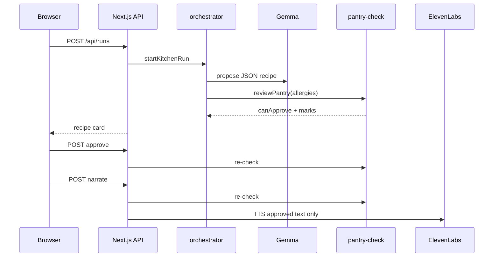

*Submission for [Hacktoberfest Weekend: Build for a Friend](https://dev.to/challenges/hacktoberfest-weekend-2026-10-01)* — `#hf26challenge`

**House Pot** is a small kitchen app for **Amma** in Dhaka: one recipe from tonight’s pantry, allergies checked in code, voice only after she approves.

## The problem

Weeknight dinner in our flat is not “pick a trending recipe.” It is **what came back from the market**, who is eating, and **who cannot eat peanuts or shellfish**. Recipe apps and generic AI chefs assume you will shop for their list, trust a prompt for safety, and read long steps while the rice is on the stove. That fails when:

- the pantry is **fixed for tonight** (dal, rice, greens, whatever was affordable)
- **allergy mistakes are not acceptable**—a cousin’s peanut reaction is not a disclaimer in a chat box
- the cook wants **one clear answer**, not ten options and a wall of text
- **voice help is welcome**, but not before she has seen and accepted the exact dish

## Who it's for

**Amma**—the person who actually runs our stove in Dhaka. She improvises from habit and memory, carries the household allergy list in her head, and does not want to feel like she is “talking to an AI chef.” House Pot is also for **family members** who share the same allergies and pantry, and for **anyone** in a similar setup: one cook, real constraints, approve-before-you-listen.

Defaults in the app match our kitchen: cook name **Amma**, allergies **peanuts** and **shellfish**, pantry like `red lentils, onion, garlic, rice, cumin, spinach, yogurt`.

## How I'm solving it

| Goal | Approach |
| --- | --- |
| One dinner, not a feed | **Gemma** (`GEMMA_*`, OpenAI-compatible) returns **one** structured JSON recipe; optional **critic** pass may revise once |
| Safety you can see | **`pantry-check.ts`** marks in-kitchen vs missing and **blocks Approve** on allergen matches (shrimp → shellfish, peanut oil → peanuts); **Open Food Facts** when available—not “the model said it’s fine” |
| No surprise audio | **ElevenLabs** runs only after **Approve & read aloud** on **that** card; approve and narrate **re-run** the same checks (idempotent narrate on retry) |
| Memory across nights | **MongoDB Atlas** (or local `.data/house-pot.json` fallback) stores household, pantry habits, run history, and feedback (“less cumin next time”) |
| Hands busy at the stove | **Whisper** (local STT) for pantry dictation; narration reads **approved recipe text only**, never the raw voice note |

**Design split:** **plan** (probabilistic Gemma JSON) → **policy** (deterministic pantry + allergen code) → **deliver** (TTS gated on approve). Human approval binds to **this** card version; a stale “yes” cannot narrate a recipe that now fails checks.

| Requirement (Amma) | Engineering |
| --- | --- |
| Cook from tonight’s pantry | `POST /api/runs` → orchestrator propose |
| Allergies enforced outside the model | `PantryReview.canApprove` / `safeToNarrate` |
| Auditable for family / judges | Ingredient marks on card; `GET /api/runs/:id/trace` |

Full BRD table, C4 diagrams, and state machine: [README on GitHub](https://github.com/smriad/house-pot#requirements-traceability-brd--engineering).

**Real run (live smoke):** pantry = red lentils, onion, garlic, rice, cumin, spinach, yogurt; allergies = peanuts and shellfish; three diners. Gemma proposed **Mild Spinach and Red Lentil Dal with Rice**. Every line matched the pantry; narration waited until approve.

## Architecture

**Stack:** Next.js on **Render** (demo) · **Ollama + Gemma** (local plan) · **MongoDB Atlas** · **pantry-check** · **ElevenLabs** TTS after approve · **Mastra** approval gate · **Temporal** narration when the worker is up.

**Propose path (simplified):** load household memory → Gemma proposes recipe (optional critic) → deterministic pantry + allergen review → show card with marks → cook taps approve → ElevenLabs narrates that text.

**Local vs live:** same codebase. **My machine** runs Ollama `gemma3:4b`, Whisper, TabPFN meal-fit, Temporal + Mastra, Backboard + Tiger memory mirrors, Sentry traces—see `GET /api/health` when `npm run dev` is up. **Live demo** uses hosted `GEMMA_*` on Render so judges click without Ollama; `TABPFN_DISABLE=true` there keeps propose fast on free tier.

## Demo

**Live:** https://house-pot.onrender.com/

<video src="https://house-pot.onrender.com/demo.mp4" controls width="100%" title="House Pot demo — technology tour and approved recipe narration"></video>

**Demo video (~5 min):** https://house-pot.onrender.com/demo.mp4 — 1080p UI tour (male Bangladesh-style voice); each chapter names **which technology**, **where** in the UI/API, and **how** it is used, then recipe TTS (`npm run demo:record`)

**Example run (pre-publish pass):** https://house-pot.onrender.com/?run=bc1c4411-5d4b-42a3-ab04-97b0346b53ea — **Mild Spinach and Red Lentil Dal with Rice**, narrated

**Example run history (smoke test):** https://house-pot.onrender.com/history?household=8c596887-5372-4c81-bd95-8ec1babe627b

No login—the browser saves one household id on first visit (or open history with `?household=<uuid>`).

**Path for judges** (Render free tier: first load after sleep can take ~60 seconds):

1. Open the link; wait for the kitchen screen.
2. Cook name **Amma**; allergies **peanuts, shellfish**.
3. Pantry example: `red lentils, onion, garlic, rice, cumin, spinach, yogurt`.
4. Tap **Propose tonight's pot**; read which items are marked in-kitchen vs missing.
5. Tap **Approve & read aloud** only when the card is safe; audio runs after that gate.

If approve is disabled, the card shows why—a missing market item or an allergen. That is the product.

Skeptics: `src/lib/kitchen/pantry-check.ts` owns the marks; approve and narrate re-run the same logic so an old “yes” cannot read aloud a recipe that now includes shrimp.

## Code

https://github.com/smriad/house-pot

| Path | Role |
| --- | --- |
| `src/lib/gemma.ts` | OpenAI-compatible JSON recipe; `extractRecipeJsonText` for messy model output |
| `src/lib/kitchen/pantry-check.ts` | Pantry match + allergy block (system of record) |
| `src/lib/kitchen/orchestrator.ts` | Propose → check → approve → narrate |
| `src/lib/kitchen/critic.ts` | Optional second Gemma pass |
| `src/lib/db/store.ts` | MongoDB Atlas + `.data` JSON fallback |
| `src/lib/mastra/kitchen-workflow.ts` | Approval suspend when Mastra storage is up |
| `src/components/HousePotApp.tsx` | Kitchen UI |
| `render.yaml` | Render Blueprint (`TABPFN_DISABLE`, `TEMPORAL_NARRATE=false`) |

## Technologies — what I used, how, and why

I only list tools that are **`live` on my machine** when I run `npm run dev` (`GET /api/health`). I did **not** wire **SerpApi** (no key). Repo stubs for other sponsors exist for probes, but they are not part of my daily path.

**Production check** ([`/api/health` on Render](https://house-pot.onrender.com/api/health)): Gemma, MongoDB, ElevenLabs, Mastra, Backboard, Tiger, Sentry, TheMealDB, and Open Food Facts are **live**; Whisper, Temporal, embeddings, TabPFN, and SerpApi are **off** there by design (Node-only blueprint, `TABPFN_DISABLE`, no Temporal worker).

### Core application

| Technology | How I used it | Why I used it |
| --- | --- | --- |
| **Next.js 16** (App Router) | Kitchen UI + `/api/runs`, approve, narrate, health | One app for Amma’s screen and server-side safety checks |
| **React 19** + **TypeScript** | Recipe card, approve gate, run history | UI matches orchestrator states (`awaiting_approval` → `narrated`) |
| **Tailwind CSS 4** | Touch-friendly kitchen layout | Fast iteration at the stove |
| **Zod** | `recipeSchema` on every Gemma response | Catch bad JSON before it hits the card |
| **OpenAI Node SDK** | `gemma.ts` → `GEMMA_*` (Ollama locally, hosted on Render) | One client for local open weights and the public demo |

### Planning (probabilistic)

| Technology | How I used it | Why I used it |
| --- | --- | --- |
| **Ollama + Gemma** `gemma3:4b` | `proposeRecipe()` → one JSON recipe from pantry + allergies | Open-weight planning on my laptop |
| **Gemma critic** | Second pass may replace the draft once | Better card before Amma reads it; safety still in code |
| **Cook brief** | One-line summary on the card | Less reading while rice cooks |
| **Embeddings** (`nomic-embed-text` via Ollama) | Rank pantry memories on propose | “Less cumin” surfaces without retyping the story |
| **Hosted `GEMMA_*`** (Render only) | Same code path on https://house-pot.onrender.com/ | Judges try the flow without Ollama |

### Policy (deterministic — the product)

| Technology | How I used it | Why I used it |
| --- | --- | --- |
| **`pantry-check.ts`** | In-kitchen / missing marks; blocks approve on allergens | Allergy control is code, not a prompt |
| **Re-check on approve + narrate** | Same review on both routes | Stale “yes” cannot read aloud a new allergen |
| **Open Food Facts** | Allergen tags when enriching ingredients | Extra signal beyond string match |
| **TheMealDB** | Public dish names on propose | Ground the planner without another API key |

### Voice

| Technology | How I used it | Why I used it |
| --- | --- | --- |
| **ElevenLabs** | TTS **only** after approve; idempotent narrate | Clear steps for Amma—never the pantry voice note |
| **Whisper** (local Python) | `POST /api/transcribe` for pantry dictation | Hands busy; STT stays on my machine |

### Memory and persistence

| Technology | How I used it | Why I used it |
| --- | --- | --- |
| **MongoDB Atlas** | Households, runs, memories, feedback | Tuesday’s lentils are not a new lecture |
| **Backboard** | Semantic cook memories on propose / feedback | Longer-thread kitchen context |
| **Tiger Data (Postgres)** | Mirrors feedback after a run | SQL sidecar for memory experiments |
| **`localStorage`** | Browser household id | No login; share history with `?household=` |

### Workflows, scoring, observability

| Technology | How I used it | Why I used it |
| --- | --- | --- |
| **Mastra + LibSQL** | Approval gate suspends until she taps approve | Human-in-the-loop as a workflow step |
| **Temporal** | Durable narrate when worker + `TEMPORAL_ADDRESS` are up | Safe retries locally (`TEMPORAL_NARRATE=false` on Render) |
| **TabPFN** (Python) | Blended with heuristic friend-fit score on propose | “Would Amma cook this?” signal in dev |
| **Sentry** | Spans on agent steps | Trace propose → approve → narrate |
| **Run trace** | `GET /api/runs/:id/trace` | Show judges each step |

### Demo and deploy

| Technology | How I used it | Why I used it |
| --- | --- | --- |
| **Render** | `render.yaml` → live URL for the challenge | Public demo |
| **GitHub Actions** | `live-smoke.yml` | CI hits propose on production |
| **Playwright** | `npm run demo:record` → `demo.mp4` | Video for judges who skip cold start |

### Design takeaway

**Plan** (Gemma on Ollama) → **policy** (`pantry-check`) → **deliver** (ElevenLabs, gated). Memory and workflow tools support that line—they do not replace it.

Human-in-the-loop only works when the card shows what is on the **shelves** and what would be **unsafe**—not a blind “trust me” approve button.

## Why Does Open Innovation Matter?

In a Dhaka household the sensitive data is not “inspiration.” It is **who reacts to peanuts**, what **Amma actually bought** before the monsoon rain, and what we **cannot** send to a closed meal API abroad.

Open-weight **Gemma** can plan on a machine we run—laptop, small server, or a GPU droplet if we outgrow Ollama. The validation logic stays ours. The Render link uses hosted inference so judges anywhere can click; I would rather say that plainly than pretend the demo box is offline-only.

**ElevenLabs** is the closed piece, and it sits **behind** approve—it never sees the voice note, only the recipe she accepted.

MongoDB holds what she would otherwise repeat at every family lunch: allergies, pantry habits, “a little less chili next time.”

## Prize Categories

- **Best Use of Gemma** — dinner from the pantry + constraints; structured JSON recipe.
- **Best Use of ElevenLabs** — narration only after approve; not before.
- **Best Use of MongoDB Atlas** — household memory across nights in Dhaka and on the live URL.
- **Best Use of Render** — https://house-pot.onrender.com/ from `render.yaml`.

## My Agent Session

Curated build log: Playwright `demo.mp4` pipeline, per-chapter tech voiceover (technology / where / how), Bangladesh-style narrator, and syncing this submission draft to DEV.



Session on DEV: [House Pot — demo video, tech voiceover, and submission sync](https://dev.to/agent_sessions/house-pot-demo-video-tech-voiceover-and-dev-submission-sync-xuczlj)

## Friend quote

> “The dal was right—use a little less cumin next time. And I will not listen to the voice until I tap approve.”  
> — Amma, after the first real dinner from House Pot.

---

*Built for Hacktoberfest Weekend 2026 — Build for a Friend, from a Bangladesh kitchen.*
